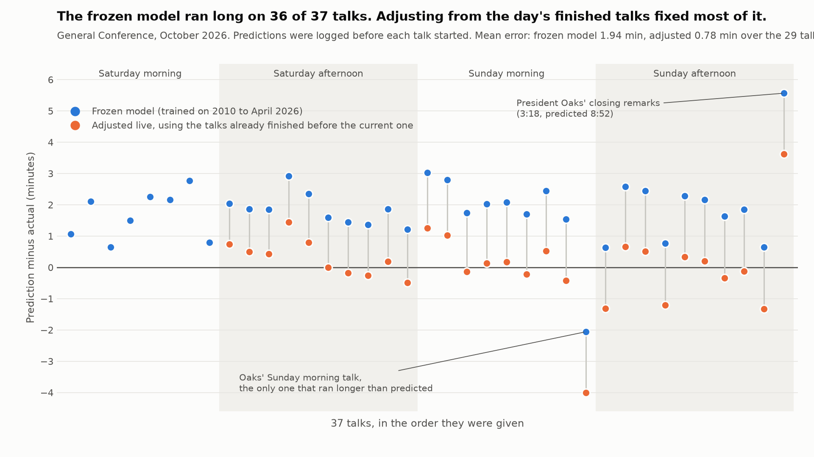

# General Conference talk duration predictor

Predicts how long a General Conference talk will run using only what is known
when the speaker is announced: who they are, their calling, the session, their
speaking order, the month, and how long their earlier talks ran.

## Setup

```
uv sync
```

Python 3.12, dependencies in `pyproject.toml` (pandas, scikit-learn, CatBoost,
requests, beautifulsoup4).

## Commands

| Step | Command |
|---|---|
| Baseline on the original CSV only | `uv run python scripts/train.py --legacy-only` |
| Collect 2021-04 .. 2026-04 talks (+ Oct 2020 for the compatibility check) | `uv run python scripts/collect.py --extra 2020-10 --compare-legacy` |
| Check unusable legacy runtimes against the official talk pages | `uv run python scripts/verify_durations.py` |
| Train and compare all models on legacy + collected data | `uv run python scripts/train.py` |
| Rule tests (history leakage, speaking order, parsing, aliases) | `uv run python -m pytest -q` |
| Log a whole session interactively | `uv run python scripts/predict.py live` |
| Predict a talk | `uv run python scripts/predict.py predict --speaker "Dale G. Renlund" --calling "Of the Quorum of the Twelve Apostles" --session sunday-morning --order 3 --log` |
| Record the actual duration afterwards | `uv run python scripts/predict.py log-actual --speaker "Dale G. Renlund" --session sunday-morning --actual 14:12` |
| Fill actuals from the official pages, once scraped | `uv run python scripts/predict.py fill-actuals --conference 2027-04` |
| Re-run the October 2026 frozen configuration and score it on October 2026 as a hold-out | `uv run python scripts/train.py --no-session-size --through 2026-04 --predict-next --no-bundle --tag thru2026-04` |
| Same with the expected-session-size features | `uv run python scripts/train.py --through 2026-04 --predict-next --no-bundle --tag thru2026-04_sess` |
| Backtest the live adjustment on any predictions file | `uv run python scripts/backtest_adjustment.py --file outputs/holdout_predictions_thru2026-04_sess.csv` |
| Redraw the October 2026 chart | `uv run python scripts/plot_oct2026_errors.py` |
| Score logged predictions | `uv run python scripts/predict.py score` |

`--conference` on `predict`/`log-actual` defaults to `2026-10`; pass `--conference 2027-04` for the next one. `--calling` takes
the role as printed on the talk page (e.g. `Of the Seventy`, `President of the
Church`, `Relief Society General President`).

### Live mode (the easy way to log a session)

```
uv run python scripts/predict.py live
```

Pick the session once (1-4). Then, for each talk, type the speaker's name
when it appears on screen and press Enter. A surname is enough: the command
finds the speaker in the data, proposes their most recent calling (press
Enter to accept, or type the calling shown on screen or a number from the
list), prints the predictions and logs them. The talk number counts up by
itself. Commands inside live mode: `u` undoes the last logged talk, `t 12:34`
records a hand-timed actual for it, `o 5` sets the next talk number, `s`
changes session, `q` quits. The full `predict` command below still works for
one-off use.

**Adjusted line.** Once at least one talk of the current conference has an
actual duration in the log (a `t` time or `fill-actuals`), live mode prints an
extra `adjusted` prediction: frozen CatBoost shifted by n/(n+4) times the mean
miss of the finished talks, excluding the Church President's remarks. It is
logged under the model name `catboost_adj`; the frozen `catboost` rows are
untouched, so the clean hold-out comparison is preserved. Backtest on the four
test conferences (`scripts/backtest_adjustment.py`): MAE 1.19 -> 0.98 min
overall, 2.44 -> 1.32 in April 2026 (format change), 0.75 -> 0.75 and
0.48 -> 0.42 in 2024-10 / 2025-04, but 1.04 -> 1.40 in October 2025, where the
early talks were unrepresentative. It helps when a whole conference runs
differently from history and hurts when the first few talks mislead.

Non-talk items can be estimated too, so nothing on the program has to be
skipped: type `sustaining`, `audit` or `solemn` at the speaker prompt. These
are not talks and get no number; the estimate is a plain average of the last
three same-month occurrences from `data/processed/program_items.csv`
(`scripts/collect_program_items.py`), logged under the model name
`program_mean` and scored separately. October sustainings have run 3:25 to
4:36 since 2021; April ones 5 to 9 minutes because of Area Seventy changes;
the audit report is April-only and about 1:45.

### How to count the talk number during the live broadcast

`--order` is the talk's position among the **talks** of its session, starting
at 1. Count only spoken talks. Do not count, and do not leave a gap for:

- the sustaining of General Authorities and officers,
- the Church Auditing Department report or statistical report,
- a solemn assembly,
- videos, musical numbers, hymns and prayers.

Example: Saturday afternoon opens with the sustaining, then the audit report,
then the first speaker. That speaker is `--order 1`. If a talk precedes the
sustaining (as in October 2025), it is `--order 1` and the talk after the
sustaining is `--order 2`. This is how both data sources are numbered: the
legacy CSV already counted talks only, and the scraper drops the same items
and renumbers; the two agree on every October 2020 session.

## Data

- `data/raw/talks.csv` (unchanged): 794 rows, April 2010 to October 2020, with
  `runtime` as `m:ss`. 130 runtimes are missing, 6 are unparseable (`17:60`,
  `11:60`, ...), and 2 are impossible given the word count (a 1,960-word talk
  at `1:23`, a 1,345-word talk at `1:55`). One solemn assembly row is dropped
  as a non-talk.
- `data/processed/legacy_duration_fixes.csv` (`scripts/verify_durations.py`):
  each of those 138 rows was looked up on its official talk page and the
  `<video>` duration recorded. Result: all 130 missing runtimes were present
  on the page and are filled from it; the 6 `mm:60` strings all correspond to
  a page duration of `mm:59` (not `(mm+1):00`, so the source rounded up) and
  are corrected to the page value; the `1:23` talk is `18:09` on the page and
  is corrected; the `1:55` talk is `1:54` on the official page too, which is
  impossible for 1,345 words, so it stays excluded. Corrected rows carry
  `duration_source = video_data_duration` and a `duration_note`; the original
  string is kept in `duration_raw`. Nothing is imputed: a value is changed only
  when the official recording metadata supplies it.
- `data/processed/talks_collected.csv`: scraped from
  `churchofjesuschrist.org/study/general-conference/<year>/<month>`. Each talk
  page embeds a base64 JSON state; the talk body carries a `<video>` element
  with `data-duration` (milliseconds) and `data-duration-string` (`m:ss`).
  That is the recording duration used here. The mp3 on the same page is
  longer (it includes intro/outro), so it is recorded as a URL only and never
  used as a duration.
- Compatibility check (`outputs/duration_compatibility.md`): for the 26
  October 2020 talks timed in both sources, the scraped video duration matches
  the CSV runtime to within 0.5 s, so the two sources are the same measurement.
  The legacy CSV remains the source of record for 2010-2020; scraped rows for
  overlapping conferences are only used for this check.
- Sustainings, audit/statistical reports, solemn assemblies and video
  interludes are not talks. Speaking order is renumbered over the remaining
  talks in each session, matching how the legacy CSV counted (see "How to
  count `--order`" above).
- Speaker aliases are an explicit table (`data.SPEAKER_ALIASES`): `Becky
  Craven` -> `Rebecca L. Craven` (site byline vs CSV), `Larry Echo Hawk` ->
  `Larry J. Echo Hawk` and `L. Harkness` -> `Lisa L. Harkness` (two spellings
  inside the CSV). `speaker` is the canonical name used for histories;
  `speaker_source` keeps the spelling from the source. A surname/initial scan
  of all 1,168 bylines found no other variants.
- Duplicates: none by URL and none by (conference, session, speaker, title).
  134 rows are a speaker's second or later talk in the same conference (mostly
  the President of the Church); these are real separate talks.

## Modeling

Predictors (all known before the talk begins): speaker, calling (printed role
and a 10-way calling group), session, speaking order, month, and history
features computed from strictly earlier conferences: speaker mean / median /
std / last / min / max duration and counts, speaker mean in the current
calling, calling mean (all-time and last two years), role mean, session mean,
and global mean. Title, text, kicker, word count and the talk's own runtime are
never predictors.

Since October 2026 the history features also include the expected session
size: `session_n_prev` (talks in the same session at the previous conference)
and `session_n_recent` (its mean over the last two years). Like every history
feature they come from strictly earlier conferences, so nothing has to be
entered at prediction time; `predict.py` prints the value it used.
`train.py --no-session-size` withholds them and reproduces the earlier
predictor set. See "Learning the session size" below.

Models compared:

1. **Baseline**: speaker historical mean, shrunk toward the calling mean with
   `shrink` pseudo-talks, falling back to the calling mean (then global mean)
   when the speaker has fewer than `min_n` timed talks.
2. **Ridge regression** on the history features plus one-hot calling group,
   session, month and (optionally) speaker.
3. **CatBoost regression** with calling group, role, session and month as
   one-hot categorical features and the history features as numeric. It gets
   no `speaker` categorical: CatBoost's target statistics would average a
   speaker's other talks, including same-conference ones, which breaks the
   strictly-earlier rule. Speaker information enters only through the history
   features.

Splits are chronological by whole conference: the most recent 4 conferences
are the test set, the 4 before are validation. Hyperparameters (small fixed
grids) are chosen on validation; the chosen setting is refit on train+val and
scored once on test, then refit on everything for prediction.

History features never see the same conference: `features.add_history_features`
builds each conference's features from rows with a strictly smaller conference
index, and `history_features` raises if asked otherwise.
`tests/test_pipeline_rules.py` checks that two talks by one speaker in the same
conference do not enter each other's history.

**Test-set status.** The first run's test errors were inspected (by conference
and by calling) before the data fixes and the CatBoost change above. The
re-run is therefore labelled *exploratory* in `outputs/metrics_*.md`
(`train.py --exploratory`). The first untouched conference is October 2026:
predictions logged with `predict.py --log` before each talk and scored with
`predict.py score` are the clean evaluation.

The range printed next to each prediction is an **uncalibrated estimated
range**, not a confidence interval. Its half-width is the 80th percentile of
validation absolute errors; the share of test talks that actually fell inside
it is reported next to it (62% for CatBoost, 69-74% for the others). Nothing
has been done to make that share hit a target.

## Results

Both stages below are the exploratory re-run after the duration fixes (791 of
793 legacy talks now timed, up from 655).

### Stage 1: legacy CSV only (`outputs/metrics_legacy.md`)

791 timed talks, 2010-04 .. 2020-10. Train 2010-04 .. 2016-10 (521),
validation 2017-04 .. 2018-10 (139), test 2019-04 .. 2020-10 (131 timed talks,
26 by speakers never seen before). All MAE in minutes.

| model | selected | val MAE | test MAE | seen (105) | unseen (26) | Church President (16) | Seventy (22) |
|---|---|---|---|---|---|---|---|
| naive (recent global mean) | - | 2.92 | 2.82 | 2.73 | 3.19 | 5.73 | 2.86 |
| baseline (speaker mean, shrunk to calling) | `min_n=1, shrink=3` | 1.59 | 1.92 | 2.06 | 1.35 | 5.77 | 0.73 |
| ridge | `alpha=30, no speaker one-hot` | 1.51 | 1.88 | 1.95 | 1.59 | 5.14 | 1.03 |
| catboost | `depth=6, RMSE, 668 iters` | **1.38** | **1.52** | 1.56 | 1.35 | 3.80 | 1.01 |

Unseen speakers are *easier* than seen ones: almost all are Seventies or
auxiliary leaders whose talks cluster tightly around 10 minutes, so the
calling fallback is accurate. The large errors are concentrated in the
President of the Church (MAE ~5 min), who gives both 2-6 minute remarks and
18-24 minute full talks in the same conference; nothing in the allowed predictors
separates the two.

### Stage 2: legacy + scraped through April 2026, the October 2026 frozen configuration (`outputs/metrics_thru2026-04.md`)

1,166 timed talks, 33 conferences (2010-04 .. 2026-04). This is the configuration
that was frozen for October 2026; `train.py --no-session-size --through 2026-04`
reproduces it exactly (same selected settings, same test numbers). Train 2010-04 ..
2022-04 (900 timed), validation 2022-10 .. 2024-04 (132), test 2024-10 ..
2026-04 (134 timed talks, 29 by unseen speakers). Every model is scored on
exactly the same 134 test rows. All MAE in minutes.

| model | selected | val MAE | test MAE | test median AE | range half-width | share of test talks in range |
|---|---|---|---|---|---|---|
| naive | - | 1.84 | 2.10 | 1.68 | 2.46 | 73% |
| baseline | `min_n=1, shrink=3` | 1.20 | 1.39 | 0.83 | 1.60 | 69% |
| ridge | `alpha=30, no speaker one-hot` | 1.26 | 1.30 | 1.00 | 1.65 | 74% |
| **catboost** | `depth=6, RMSE, 55 iters` | **0.95** | **1.19** | 0.68 | 1.06 | **62%** |

Test MAE by segment (same rows for every model):

| segment | n | naive | baseline | ridge | catboost |
|---|---|---|---|---|---|
| all | 134 | 2.10 | 1.39 | 1.30 | 1.19 |
| Church President | 5 | 4.73 | 5.48 | 4.77 | 3.49 |
| Seventy (`Of the Seventy`) | 52 | 2.26 | 0.87 | 1.02 | 0.96 |
| Presidency of the Seventy | 2 | 1.49 | 0.47 | 0.89 | 0.44 |
| unseen speaker | 29 | 2.32 | 0.96 | 1.08 | 1.01 |
| seen speaker | 105 | 2.04 | 1.50 | 1.37 | 1.24 |

CatBoost against the baselines, paired per talk on the same 134 rows
(difference in absolute error, CatBoost minus other, minutes; bootstrap 95% CI):

| comparison | mean diff | 95% CI | share of talks CatBoost closer |
|---|---|---|---|
| vs naive | -0.91 | [-1.07, -0.74] | 82% |
| vs baseline (speaker mean) | -0.20 | [-0.38, -0.04] | 57% |
| vs ridge | -0.12 | [-0.24, -0.00] | 54% |

So CatBoost's edge over the speaker-mean baseline is real but modest (about 12
seconds per talk on average) and comes almost entirely from the First
Presidency and the Twelve; for Seventies the plain speaker mean is as good or
slightly better (0.87 vs 0.96).

Test MAE by conference (catboost / baseline): 2024-10 0.75 / 0.86, 2025-04
0.48 / 0.68, 2025-10 1.04 / 1.17, 2026-04 2.44 / 2.80. April 2026 was the
first conference under a new First Presidency, ran four sessions with more
talks each, and averaged 9.8 minutes per talk versus roughly 12.4 for the
preceding years; every model over-predicted it. That regime shift is also why
the estimated ranges fall short on test: the catboost range (built from
validation errors) covered 62% of test talks, the others 69-74%. Treat them as
rough guides, not calibrated bounds; `predict.py` prints the measured share
next to every range.

Remaining error is dominated by the President of the Church (3.5 min) and the
President of the Twelve (3.6 min), for the same remarks-vs-full-talk reason as in
stage 1.

### October 2026: the live run

The bundle used for October 2026 was trained on 2026-10-03 (UTC) from all
1,166 timed talks through April 2026 (stage 2 above), after settings were
chosen on the 2022-10 .. 2024-04 validation conferences. It was not retrained
during the conference; every logged prediction carries its version. For each
of the 37 talks the prediction was logged in live mode before the speaker
started, with a stopwatch time entered afterwards; `fill-actuals` later
replaced those with the official video durations.



`predict.py score --conference 2026-10` (official durations, MAE in minutes):

| model | n | MAE | median AE |
|---|---|---|---|
| naive | 37 | 2.43 | 3.02 |
| baseline (speaker mean) | 37 | 2.66 | 2.33 |
| ridge | 37 | 2.40 | 2.37 |
| catboost (frozen, recommended) | 37 | 1.94 | 1.87 |
| catboost_adj (live adjustment) | 29 | 0.78 | 0.49 |
| program_mean (the sustaining) | 1 | 0.57 | 0.57 |

What happened: the frozen model over-predicted 36 of the 37 talks, by 1.8
minutes on average. Talks averaged 9.6 minutes against 12 to 13 in the
training years; the sessions had 8, 10, 9 and 10 talks instead of the usual 6
or 7. Nothing in the frozen predictor set could see that coming. The only talk
that ran longer than predicted was President Oaks' Sunday morning talk;
his 3-minute closing remarks were the largest miss (predicted 8:52).

The live adjustment (frozen CatBoost shifted by the shrunk mean miss of the
day's finished talks) started working from the second talk with a hand time on
Saturday afternoon, so it covers 29 talks. Over those 29 it cut the error from
about 1.9 to 0.78 minutes; replayed over all 37 (`backtest_adjustment.py --file
outputs/holdout_predictions_thru2026-04.csv`) it gives 0.90. It made President
Oaks' Sunday morning talk worse (the shift was downward, the talk ran long).

### Learning the session size (after October 2026)

The October result says the missing information was "how many talks are in
this session". The program is not published in advance, so the model cannot
be told; instead it now learns an expectation from earlier conferences, the
same way it learns a speaker's mean: `session_n_prev` is the talk count of
the same session in the previous conference and `session_n_recent` its mean
over the last two years (`features.history_features`, strictly earlier
conferences only, no input at prediction time). `train.py --no-session-size`
withholds the two columns and reproduces the frozen predictor set.

Two runs with the data restricted to 2026-04 (`--through 2026-04
--predict-next`), so that October 2026 is a true hold-out for both:

| CatBoost | val MAE | test MAE 2024-10 .. 2026-04 (134 talks) | October 2026 hold-out (37 talks) | hold-out with the live adjustment replayed |
|---|---|---|---|---|
| frozen predictor set | 0.95 | 1.19 | 1.94 | 0.90 |
| + expected session size | 0.89 | 1.14 | 1.58 | 0.87 |

Ridge went from 1.30 to 1.37 on test and from 2.40 to 1.96 on the hold-out;
the speaker-mean baseline is unchanged at 2.66. The expected sizes for
October 2026 were 8, 8, 9, 9 (April 2026's counts) against the real 8, 10,
9, 10, and the model had only one past conference (April 2026) in which a
large session went with short talks, so it closed about a quarter of the gap:
mean over-prediction fell from 1.8 to 1.4 minutes, and 35 of 37 talks were
still over-predicted. For comparison, the same model given the real session
counts (not usable live) reached 0.94 on the hold-out, which is the ceiling
this feature can approach as more conferences in the new format accumulate.
Caveats: the test conferences had been inspected before this change
(exploratory, labelled as such in `outputs/metrics_thru2026-04_sess.md`), and
the hold-out is one conference. April 2027 is the clean test.

### Model for April 2027 (`outputs/metrics_all.md`)

`train.py` (default: expected-session-size columns on, all data through
October 2026). 1,203 timed talks, 34 conferences. Train 2010-04 .. 2022-10
(935), validation 2023-04 .. 2024-10 (131), test 2025-04 .. 2026-10 (137).
Exploratory for the same reasons as above.

| model | selected | val MAE | test MAE | test MAE by conference 2025-04 / 2025-10 / 2026-04 / 2026-10 |
|---|---|---|---|---|
| naive | - | 1.82 | 2.28 | 1.66 / 2.01 / 2.98 / 2.43 |
| baseline | `min_n=1, shrink=3` | 1.05 | 1.86 | 0.68 / 1.17 / 2.80 / 2.66 |
| ridge | `alpha=0.3, session size` | 1.08 | 1.70 | 0.91 / 1.14 / 2.64 / 2.03 |
| **catboost** | `depth=6, MAE, 440 iters, session size` | **0.96** | **1.50** | 0.56 / 1.09 / 2.30 / 1.94 |

The two 2026 conferences dominate the test error for every model. Note that
the October 2026 column here (1.94) is not a hold-out number: October 2026 is
inside this run's test split, so settings were not chosen on it, but the
numbers above were looked at while writing this. The April 2027 log is the
real evaluation.

### What would help next

- A "times this speaker has already spoken in this conference" feature would
  separate opening/closing remarks from full talks for the First Presidency.
  It is known before the talk begins but was left out of the predictor list.
- Conformal-style intervals re-fit after each conference, so coverage tracks
  format changes like April 2026.
- Retrain after every conference and keep the per-conference log, so the
  expected-session-size features and the adjustment can be judged on more
  than one conference. The session-size features should get sharper as more
  conferences in the new format enter the history.

### Running the next conference (April 2027)

**Frozen model.** Train once before the conference (`uv run python
scripts/train.py`), run `predict.py info` to write `outputs/model_manifest.json`,
and do not retrain until the conference is over. Every logged prediction
carries `model_version`.

**Logging.** `live` (or `predict --log`) writes one row per model with
timestamp, model version, conference, speaker, calling, session, order and,
in live mode, the `catboost_adj` row once a finished talk has a time. A talk
that already has a logged prediction is not overwritten; use `--force` or
`remove` on purpose.

**Timing convention for actuals.** The reference measurement is the
`data-duration` of the talk's `<video>` on the official page (the same
measurement as the whole training set). `fill-actuals` copies it into the log
and marks `actual_source = video_data_duration`; it replaces any hand-timed
value and prints the difference. A stopwatch time (`t 12:34` in live mode or
`log-actual`) is provisional (`actual_source = hand`): start at the speaker's
first word, stop at the end of "amen", enter as `m:ss`.

Sessions: `saturday-morning`, `saturday-afternoon`, `sunday-morning`,
`sunday-afternoon` (`saturday-evening` exists in older data).

```
uv run python scripts/predict.py live --conference 2027-04      # during the broadcast

# or one talk at a time (count --order over talks only, see above)
uv run python scripts/predict.py predict --speaker "Dale G. Renlund" --calling "Of the Quorum of the Twelve Apostles" --session saturday-morning --order 2 --conference 2027-04 --log
uv run python scripts/predict.py log-actual --speaker "Dale G. Renlund" --session saturday-morning --actual 14:12 --conference 2027-04

# a few days later, when the talk pages carry the recording duration
uv run python scripts/collect.py --start 2027-04 --end 2027-04
uv run python scripts/collect_program_items.py
uv run python scripts/predict.py fill-actuals --conference 2027-04
uv run python scripts/predict.py score --conference 2027-04
uv run python scripts/train.py                                   # retrain so April 2027 becomes history
```

Logged actuals are for scoring only. The models learn from a conference only
when `train.py` is re-run after `collect.py` has scraped it.

## Layout

```
scripts/collect.py   scrape index + talk pages, cache HTML, log failures
scripts/verify_durations.py  look up unusable legacy runtimes on the official pages -> legacy_duration_fixes.csv
scripts/backtest_adjustment.py  backtest of the in-conference bias adjustment (live mode's "adjusted" line); --file/--col for any predictions CSV
scripts/plot_oct2026_errors.py  the October 2026 chart from outputs/predictions_log.csv
scripts/collect_program_items.py  durations of sustainings / audit reports / solemn assemblies -> program_items.csv
scripts/train.py     build dataset, history features, chronological eval, save models/bundle.joblib;
                     --through / --predict-next score a later conference as a true hold-out
scripts/predict.py   predict / log-actual / score
src/general_conference_runtime_predictor/{data,features,models,paths}.py
data/raw/            original CSV (do not modify)
data/processed/      talks_collected.csv, legacy_duration_fixes.csv, program_items.csv, talks_dataset.csv
tests/               pytest rule checks
data/cache/          HTML cache (gitignored)
outputs/             metrics_*.md/json, test_predictions_*.csv, holdout_predictions_*.csv, data_report.json,
                     duration_compatibility.md, collect.log, verify_durations.log, predictions_log.csv,
                     oct_2026_errors.png
models/              bundle.joblib, bundle_2026-10-03_frozen.joblib (gitignored)
```
